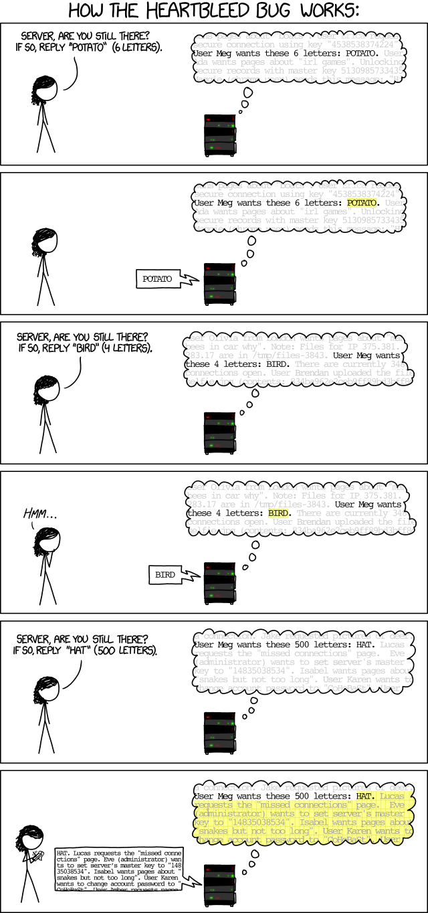
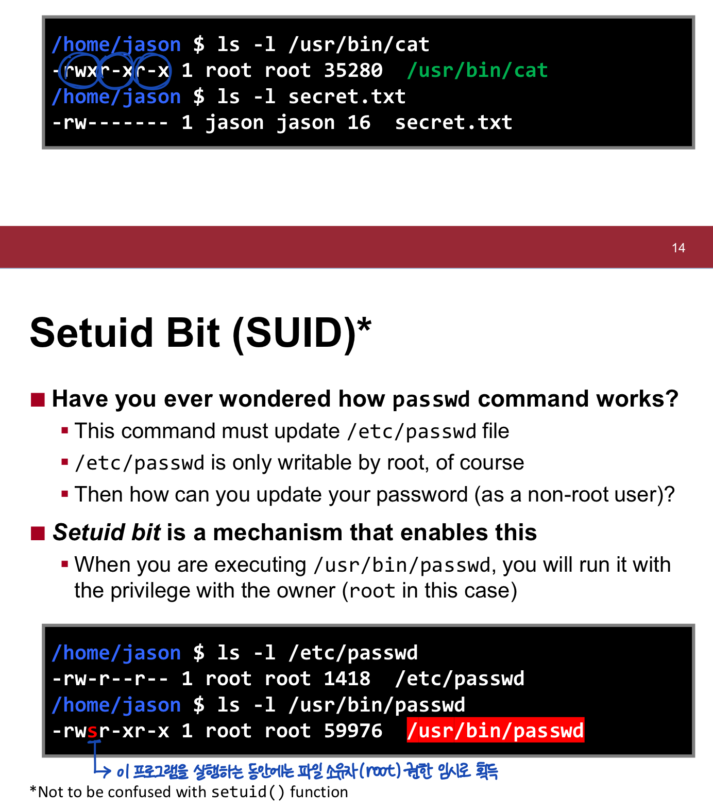

# Software Security
- vulnerability
	- bug: 프로그램이 오작동하게 하는 에러
	- vulnerability: security issue를 일으키는 bug  
	e.g. `BOF` (buffer overflow) -> corrupt other data in the memory
- exploitation
- mitigation
- detection

## Basic Concepts and Terminologies in Security

### CIA properties
1. `Confidentiality` 기밀성  
	Secrets must be kept secret  
2. `Integrity` 무결성  
	Data should not be tampered  
3. `Availability` 가용성  
	The system must be usable (e.g. 도스 공격)  

### Common types of attakcs
- `Denial-of-service`  
	- Shutting down your system or service running on it  
	- e.g. blue screen of death, 503 error  
- `Code execution`  
	- Running arbitrary/unintended code in your system  
- `Privilege escalation`  
	- Gaining unintended privileges  
	- e.g. kernal을 trigger하여 root 권한 탈취  
- `Information leakage` (= privacy leakage)  
	- Accessing sensitive data  
	- e.g. Heartbleed bug  
	  

### Threat Model
넓은 의미: 시스템의 잠재적 취약점과 위협을 identify하는 overall process  

좁은 의미: usually specifies...  
- what hackers are legitimately allowed to do
- what hackers want to achieve by exploiting vulnerabilities
- which `attack surfaces` hackers can target

# Access Control & Local Attack

  

 

**What if SUID program has BOF?**  
해커가 원하는 코드 실행이 가능해지며, root 권한도 획득 가능  
-> code execution + previlage escalation  
e.g. Hacker can even make it run execve("/bin/bash"...)
