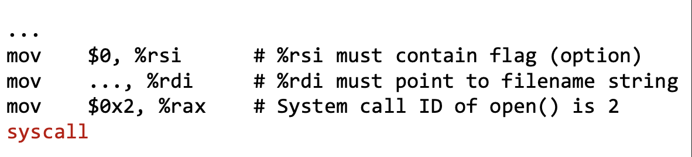
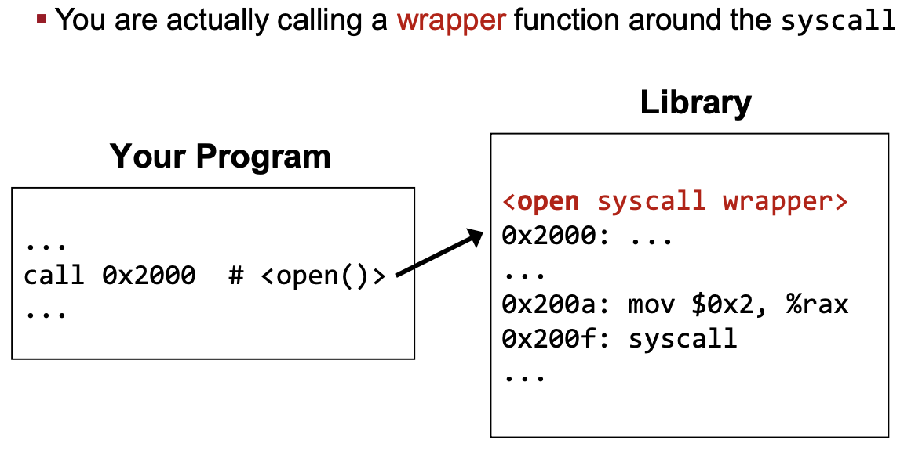
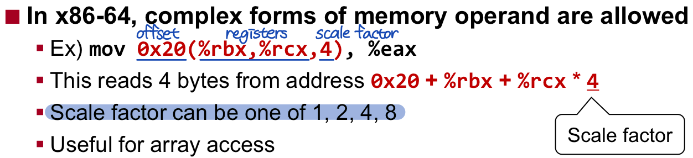
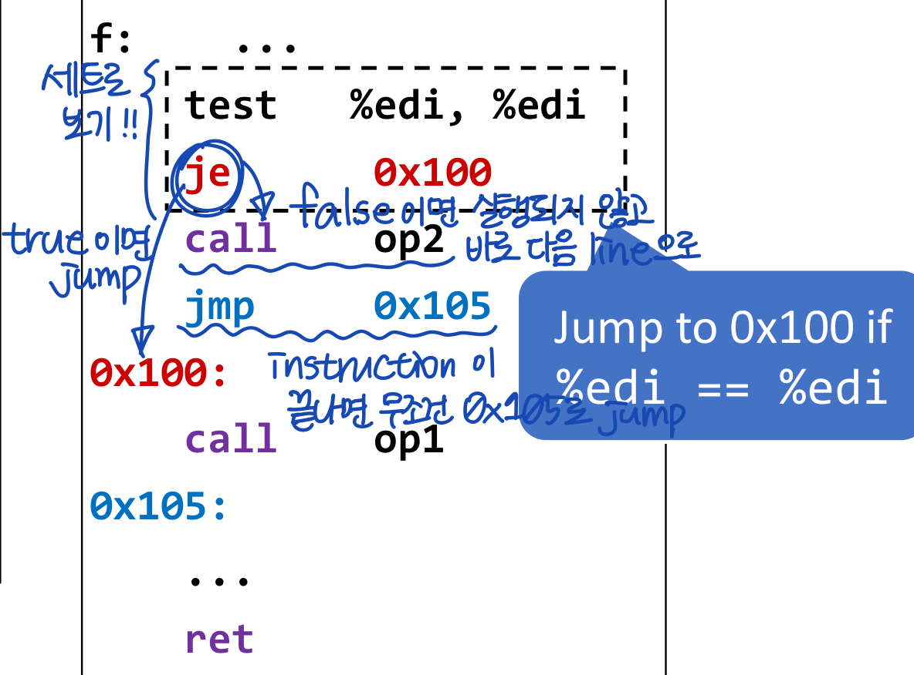

# Software Security
- vulnerability
	- bug: 프로그램이 오작동하게 하는 에러
	- vulnerability: security issue를 일으키는 bug  
	e.g. `BOF` (buffer overflow) -> corrupt other data in the memory
- exploitation
- mitigation
- detection

## Basic Concepts and Terminologies in Security

### CIA properties
1. `Confidentiality` 기밀성  
	Secrets must be kept secret  
2. `Integrity` 무결성  
	Data should not be tampered  
3. `Availability` 가용성  
	The system must be usable (e.g. DoS attack)  

### Common types of attakcs
- `Denial-of-service`  
	- Shutting down your system or service running on it  
	- e.g. blue screen of death, 503 error  
- `Code execution`  
	- Running arbitrary/unintended code in your system  
- `Privilege escalation`  
	- Gaining unintended privileges  
	- e.g. kernal을 trigger하여 root 권한 탈취  
- `Information leakage` (= privacy leakage)  
	- Accessing sensitive data  
	- e.g. Heartbleed bug  

		  

### Threat Model
넓은 의미: 시스템의 잠재적 vulnerabilities와 threats를 파악하는 전반적인 과정  

좁은 의미: usually specifies...  
- what hackers are legitimately allowed to do
- what hackers want to achieve by exploiting vulnerabilities
- which attack surfaces hackers can target

## Access Control & Local Attack

  

**What if SUID program has BOF?**  
해커가 원하는 코드 실행이 가능해지며, root 권한도 획득 가능  
-> `code execution + previlage escalation`  
e.g. Hacker can even make it run execve("/bin/bash"...)

## System call
  

  

# Assembly Language
## Registers in x86-64
Each register is 8 bytes,  
can access its lower 4 bytes(%eax), 2 bytes(%ax), or 1 byte(%ah, %al)  
- Set lower 4 bytes and clear hight 4 bytes(나머지 자동으로 0으로 채워줌)

|Registers||
|:---:|:---|
|%rax|return value|
|%rbx||
|%rcx||
|%rdx|3rd arg|
|%rsi|2nd arg|
|%rdi|1st arg|
|%rsp|stack pointer|
|%rbp||
|%r8 ~ %r15||
|%rip|instruction pointer(= program counter)|  

|Flag registers||
|:---:|:---|
|%ZF||
|%SF||
|%CF||
|%OF||  

- `immediate`: constant integer value(e.g. $0x400, $-533)
- `register`(e.g. %rax)
- `memory`(e.g. (%rax), 0x1000)
	- cannot do memory-memory transfer with a single instruction

  

- `lea`: pointer computation only(메모리 주소 계산)
	- often abuse it for arithmetic operation
- `mov`: loads memory(실제 메모리에 접근)

  
