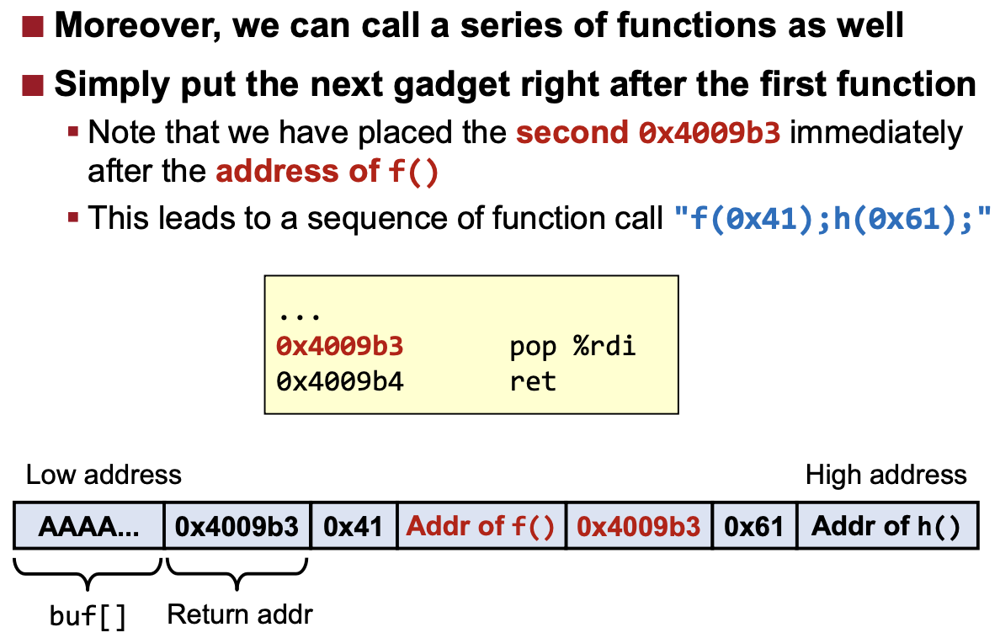

# Basics of Buffer Overflow

## Memory Layout
  

|||
|:---:|:---|
|Stack|local variables|
|Heap|dynamically allocated upon request <br> (e.g. malloc in C, new in C++)|
|Shared library|code that you didn't write directly|
|Data|Global variables|
|Code(Text)|code of your program|  

## BOF; buffer overflow
- stack-based buffer overflow
	- stack smashing(!= stack overflow)
	- e.g. Morris Worm(the first internet worm; 스스로를 복제하는 악성 소프트웨어 컴퓨터 프로그램) in 1988 in fingerd server(해당 서버의 접속해 있는 모든 유저의 정보 출력 가능)
- heap-allocated memory에서도 발생 가능
- `BOF only allows memory corruption (no disclosure)`
- 원인
	- unsafe 문자열 함수들
		- `gets`: \n까지 받아서 \0으로 대치해주는 함수
		- `scanf`, `strcpy`, `strcat`, ...
	- out-of-bound access(더 흔함)
- 해결
	1. BOF 자체를 없애기  
		`scanf(%s) -> scanf(%8s)`, `fgets`
	2. Exploit mitigation  
		Even if a bug exists, we can make it hard to exploit it.

### Control hijack
- Corruption of saved `return address` in the stack frame allows an attacker to `manipulate the program counter`
- stack frame layout

	  

### Code injection attack
Shellcode: shell을 실행시키는 코드  
e.g. execve("/bin/sh")

## Attacker vs defender
```
stack canary(BOF) -> memory disclosure -> NX(code injection) -> code reuse attack(ROP) -> ASLR
```

### Mitigation
#### 1. Stack canary

  

- prepared right after entering a func
- return address 바로 직전(아래) 주소에 배치됨
- Before the return of the func, check if it was corrupted
- 한계점
	1. `local vars in the same stack frame` canary 직전까지 corrupt 가능
	2. can still exploit `BOF in heap memory`
	3. canary가 모든 유형의 BOF를 감지 가능한 것은 아님
	4. memory disclosure(아래 bypass 참고)

#### 2. NX
- Non-executable memory  
- 예전에는 모든 데이터가 실행 가능했으나,  
	지금은 각 메모리 영역에 execute permission bit을 추가함  
	(Mark Stack, Heap, Data areas as non-executable)  
- code injection attack(e.g. shellcode 실행) 방어
- 한계: BOF 방어 불가

#### 3. ASLR
- code reuse attack: use the existing code (e.g. execve 함수의 인자로 "/bin/sh" 입력)
- Library code must be executable, so NX cannot prevent this
- `return-to-libc` attack
	- 인자를 컨트롤하기 쉬웠고 library code가 예측하기 쉬운 주소에 있었던 예전 형태의 공격 (32bit x86 system)
	- x86-64: 인자 조작이 어려움 + ASLR(address space layout randomization)  

	  

### Bypass
1. Memory disclosure
- can disclose the memory content and learn the stack canary value(canary 값 유추 가능)
- can get some clues about the memory layout  
	e.g. disclosing library addr  

	  

	ASLR only randomizes base address, and each func has unique and `fixed offest` -> `Disclosing the func pointer(puts_fptr)`, hacker can also learn the base address(p) and the address of execve

	  

2. `ROP(return-oriented programming)`
- gadget 사용(small code chunks)
- ROP gadgets let us execute a chosen function `with arbitrary argument`
	- 함수의 인자 개수만큼 pop -> ret
	- Library 영역의 위치를 매번 바꾸는 ASLR 우회해서 system() 실제 주소 흭득 및 "/bin/sh" 저장

	  

- ROP 예시

	  

	  

- ROP Gadgets 유형
	- pop; ... ret;
	- add $1000, %rcx; ret
	- xchg %rbx, %rdx; ret -> exchange two registers
	- mov %rax, (%rbx); ret -> write to memory

- Library function call
	- when calling library func, its %rip does not directly transfer to the library  

	  

	- Compiler and linker implicitly `generate some func pointer table and fill it`
		- to enable your program to call a func in library
		- 호출되는 모든 library func들은 PLT+GOT가 있음
		- `GOT is filled at runtime (cannot be determined during compile)`

	  

	- 따라서 프로그램 내에 function pointer variable이 없어도, we can bypass ASLR by disclosing GOT entry(function pointer)

- ROP 끝판왕  
	1. Overwrite the savd return addr by using BOF
	2. By using ROP, we can call write(1, &GOT, ...)
	3. And chain more gadgets to call more funcs and get a shell

	  
