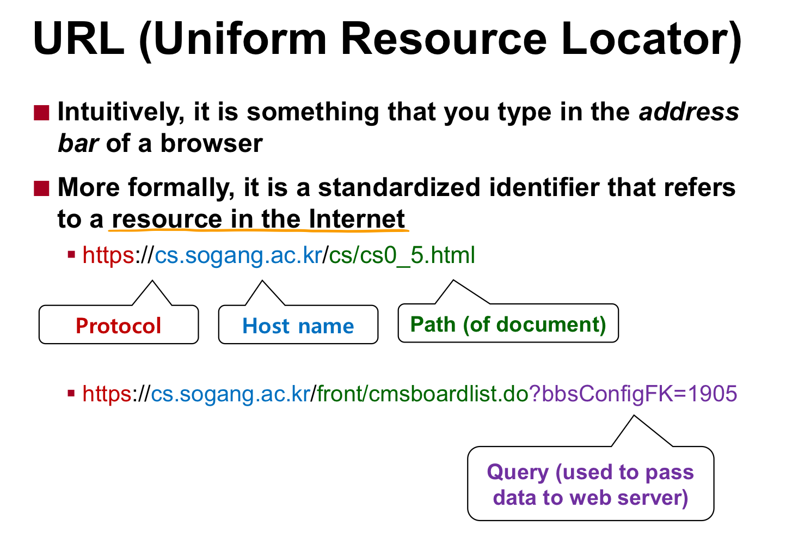
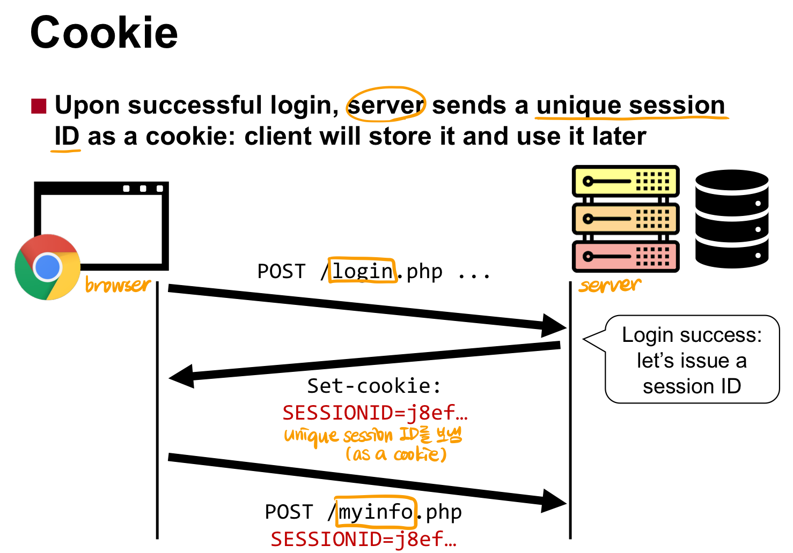

# CH10 Web Security

  

- `HTTP`(securely encrypted version은 HTTPS)
	- request: `request line` + body (e.g. GET `[path of document]` HTTP/1.1)
		- `cookie`: HTTP protocol is `stateless`(한 번의 request-response가 끝나면 connection이 끊겨 state가 사라짐) -> `browser`가 작은 조각의 데이터를 가지고 있음  

			  

	- response: `status line` + body (e.g. HPPT/1.1 200 OK)
		- `HTML`(Hypertext Markup Language)
			- use markup tags(e.g. \<body>, \, ...)
			- may contain hyperlinks: 다른 page로의 redirection
			- may contain `JavaScript code`: modify the content of HTML dynamically (이러한 script code는 client-side brower에서 실행됨)
