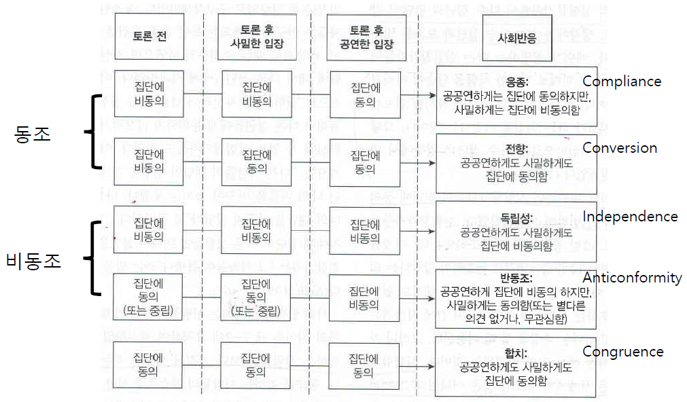
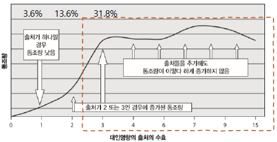
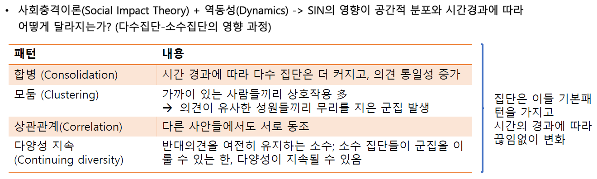
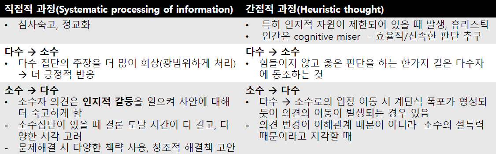
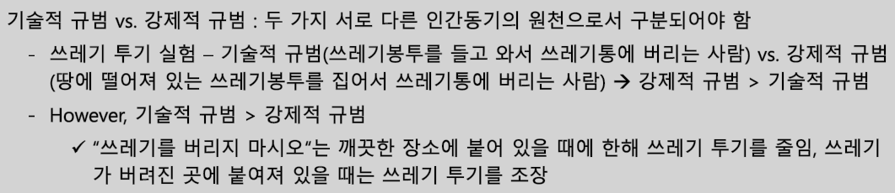
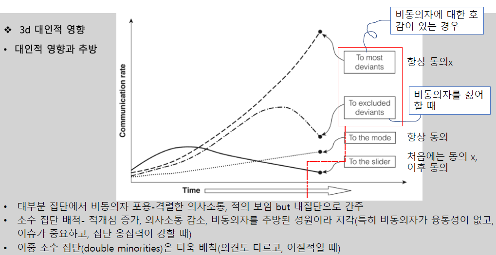

# 대인영향

사회영향: 타인의 사고, 감정, 행동을 변화시키는 대인과정
- 다수의 영향: 집단 내 합의 증가
- 소수의 영향: 개성과 혁신

## 다수집단의 영향: 다수의 위력

### 동조 및 독립성
- `애쉬의 실험상황`
    - 기준 선분과 길이가 같은 선분 찾기, 시력 검사로 가장
    - `비동조` 반응을 가장 많이 보임
        - 만장일치의 다수 집단에 맞서서도 자기 목소리를 내고, 오류가 경미할 경우 등 가끔씩만 다수집단에 동의
        - 정답과 다수집단 오답의 중간을 선택함으로써 집단 영향력에 저항하기도 함
  
  

### 맥락에 걸친 동조
#### 만장일치
- 한 명이라도 비동조자가 있으면 동조율은 최초 수준의 1/4로 하락 (-> 활발한 논의에 도움)
    - 오답으로 인한 비동조의 경우에도 동조율 감소 정도는 비슷
- 만장일치의 영향력이 큰 이유
    - 유일한 반대자는 혼자 모든 집단 압력에 직면 (소수 동맹의 크기가 커지면 동조압력 감소)
    - 이탈자의 존재는 다수 의견에 대한 맹목적 신뢰감 감소

#### 강력한 상황과 미약한 상황
- 동조 증가  
    정확성, 만장일치, 응집력, 멤버십에 투신, 근접성, 자아고갈, 다수집단 크기가 클 때, `과제중요성/난이도(high/high)`
- 동조 감소  
    책임소재(가 본인에게 있을 때), 익명성, 자기 입장이 소수입장임을 모를 때, 입장의 공공연한 표명(먼저 비동조 의사를 표했을 때), `과제중요성/난이도(high/low)`

#### (일정 수준까지의) 인원수의 영향력
  

#### 대인영향력  
라타네의 사회충격이론  
```  
social impact (사회영향) = f(SIN)
- S: strength (충격강도)
- I: immediacy (즉각성)
- N: number of srcs (출처의 수)
```  
- SIN (세 요소의 곱)이 작을수록 개인에게 미치는 사회충격 작음
- 일정 시점까지는 사람의 수가 많아질수록 충격력 증가
    - 선형증가X (비유: 1st 전구 vs 100th 전구)

### 어떤 사람이 동조하는가?
- 동조에서의 성차: 초기 연구 (여성 > 남성)
    - 면대면/큰소리로 입장 표명 시 여성 동조 증가
    - 성중립적 과제의 경우 성차 사라짐
    - 지위 배정 관련 편향의 반영일 수 있음  
    (남성은 비동조일때 보상, 여성은 동조일때 보상)
- 문화적/시대적 비교
    - 집단주의 > 개인주의 (esp. 영향의 출처가 가족/친구일 때)
    - 미국 기준, 1950년대 이후 동조 급격히 하락
    - `동조가 '시대의 산물'임을 뒷받침할 증거 없음`
        - 사회불복종이 특징이었던 시대(1960s)라고 동조가 급격히 내려가는 것도, 안정/평온기(1970-80s)라고 동조감소선이 완만한 것도 아님
- 온라인 집단 역동
    - 오프라인 대면 집단의 역동과 유사
    - 토론 -> 합의/의견일치 -> 지위/규범 구조화 -> 신입 집단성원 사회화
    - `몰개성화 효과에 관한 사회정체감 이론(SIDE)`
        - 상대적으로 익명성이 높은 온라인 집단에서는 개인정체성보다 사회정체성을 바탕으로 자기를 정의하는 경향
        - 사회정체성이 현저할 때 집단 규범에 동조하기 쉬움

## 소수집단의 영향: 소수의 위력
### 소수집단의 영향에 관한 전향이론
집단토의
- 다수 영향
    - 비교 -> `응종(compliance)`: 직접적, 즉각적, 일시적 (영향력을 미쳤던 원래의 상황에 국한된 효력)
    - 소수집단보다 다수집단이 더 큰 보상 (집단 입장을 깊이 고려X 단순히 소속되기를 바람)
- 소수 영향
    - 전환점 인식 -> 주의집중 (집단 주장을 면밀히 고려)
    - 다수의 확신을 흔들고 상황에 대한 새로운 정보 모색
    - 소수집단의 주장을 `내심 수용(private acceptance)`, 타당화 -> `전향(conversion)`: 간접적, 지연, 지속적 (새로운 상황에도 일반화되는 지속적 영향)

### 소수집단의 영향에 대한 예언
- `소수집단의 일관성` 있는 행동이 인지/대인과정을 매개하여 다수에 영향력 발휘 (입장에 대한 헌신 보여줌)  
    `Moscovici et el.`(1969)
    - 목적: 일관적인 소수는 다수가 색깔 지각 과제에서 부정확한 응답을 하게 할 수 있음
    - 청색/녹색 슬라이드 -> 애매한 슬라이드는 일관된 소수 의견에 따르는 비율 높음 (esp. 이전 실험에서 소수자에게 동조하지 않았을 때) -> `지연효과`
    - 모든 시행의 2/3에서만 녹색이라고 대답했을 때  
        동조율 8.4% -> 1.25%
- `이단특혜(Idiosyncrasy Credits): 선 동조, 후 비동조에 집단이 긍정적으로 반응`
    - 일종의 대인공로점수 (개인이 집단에 기여할 때마다 획득)
    - 집단 목표 달성 기여, 좋은 성격 특성 등이 있을 때 높아짐
    - 일반적으로 지위가 높은 사람의 비동조에 대한 허용 폭이 큼
- 충실한 변론
    - 변론의 명료한 논점, 설득력 높고 정교한 메시지의 필요성: 다수집단X 소수집단O
    - 만장일치: 소수의견 존중
    - 다수결: 소수의견 무시 가능

### 역동적 사회충격이론
  

## 대인영향의 출처

1. 암묵적 영향
2. 정보적 영향
3. 규범적 영향
4. 대인적 영향 -> 방관자 효과

### 암묵적 영향
자동적이고 무의식적인 과정에 의한 영향
- `모방`
    - e.g. 하품의 전염
    - e.g. 배심원 연구(Keyton&Beck, 2010)  
        중대한 이슈를 다루고 있을 때에도 웃음 전염
- `무심결(mindlessness)`
    - 인지적 처리과정이 감소된 상태
    - 스스로 자문 없이 자동적으로 동조

### 정보적 영향
- `사회비교`
    - 명확한 판단기준이 없는 경우 타인의 반응을 자기 생각/행동의 타당성 확인에 사용 (동조 - 다수의 반응이 옳을 것이라 생각)
    - `사회 실체`란 얼마나 많은 타인들이 같은 의견/태도를 가지고 있는지 개인들의 지각하는 정도(의견/태도의 정당성의 근거)  
    -> 타인에 의해 강화받지 못한 의견/태도는 일반적으로 불안정해짐
- 소수집단의 존속: `합의오판 효과(false consensus effect)`
    - 의견이 동일한 내집단 성원들의 의견은 과다표집, 의견이 다른 외집단 성원들의 의견은 과소표집
    - 소수자들의 신념 유지를 가능하게 해주는 심리적 기제
- `이중과정이론`  
  

### 규범적 영향
- 사회적 인정욕구 충족 및 배척의 두려움 (동조압력)
- 집단정체감을 가질 때 집단 규범을 지켜야 한다는 의무감, 내면화된 규범에 맞게 행동
- `초점이론(focus theory of normative conduct)`  

   

### 대인적 영향
- 대인적 영향과 추방  
  

- 대인 배척 (비동조자 배척)  
    처음 비동조 -> 동조한 변절자(slider)의 경우에도 대인수용이 낮음
- `사회정체성 과정(주관적 집단역학)`
    - 일탈자는 집단의 긍정적 정체성에 손상, 부정적 반응을 야기
    - 외집단과 구분 짓는 내집단의 독특성 상실
    - `미운털 효과(black-sheep effect)`: 동일한 공격적인 행동을 하는 외집단 성원보다 내집단 성원에 대해 훨씬 가혹한 평가
    - 집단과 동일시 X: 꺼림칙한 동조, 침묵, 집단으로부터 철수
    - 집단과 동일시 O: 잘못된 충성심으로 집단 결정 지지 or 비동조에 따르는 대인 부담 기꺼이 받아들임 (집단이 오류를 수정하는 조치를 취할 것이라는 희망)

### 방관자 효과
대인적 영향이 억제하는 경우
- `정보적 영향`: 다른 사람들도 도와주지 않는 걸 보니 괜찮은 상황이군
    - 비윤리적 행동 발각 가능성에 대한 추정치 변경
    - 비윤리적 행동과 관련된 사회적 규범에 대한 이해도 변경 (관행으로 인식)
- `규범적 영향`: 남의 일에 간섭하지 말아야지(창피 기피)
    - 비도덕적 행동에 동참하지 않은 사람은 해당 행동에 임한 사람들의 긍정적 자아상 위협 -> 비호감
    - 조직 부패의 경우: 집단규범 내면화, 관행
- `책임감 분산`, `책임 전가` 등
