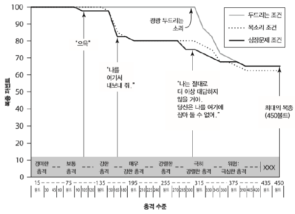
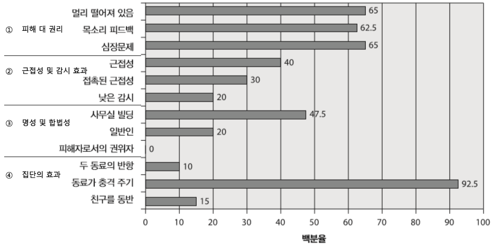

# 대인권력
인민사원 사건 - 신도 918명 최대규모 집단자살

## 권위에의 복종
`밀그램의 실험`  
cover story: 처벌이 학습에 미치는 영향 연구  
  

|조건|실험|
|:---:|:---|
|피해 vs 권리|음성귀환 조건(권리), 심장병 조건(상해)   -> 대다수가 학습자의 요구보다 권위자의 명령에 따름|
|근접성 및 감시 효과|근접조건   접촉-근접조건 (손 누르기)   낮은 감시 조건 (전화로 명령)|
|명성 및 합법성|사무실 조건 (권위 감소)   평범한 사람 조건 (합법성 감소, 복종률 낮음 but 실험 거부 시 추가협조자가 시행하면 방관)   희생자인 권위자 조건 (모든 경우에서 참가자는 실험자를 풀어줌)|
|집단의 효과|동료 쇼크 실시 조건 (방관), 두 명의 동료 반항 조건|  

  

의문점
- 참가자 행동의 진실성?
    - 20% 미만만이 상황의 진실성을 의심
- 복종과 성격 특질 간의 관계?
    - 연계시키고자 했던 추후 연구들은 성과X

## 집단에서의 대인권력
- 높은지위/낮은지위 간 양방향적 영향력 행사 가능
- 권력은 상부->하부 영향력의 사슬이 아닌, 역동적이며 협상에 의해 이루어지는 과정
### 권력의 기반
- 보상: 보상의 분배를 통제하는 힘
- 강제: 다른 사람을 처벌할 수 있는 능력
- 합법성: 복종을 요구할 수 있는 승인도니 권리
- 준거: 동일시, 매력, 존경
- 전문성: 반드시 전문가일 필요는 없으나, 전문가로 지각되어야 함
- 정보: 정보를 권력으로 바꿀 수 있음

### 권력행사의 책략
- 연성/강성  
    - 연성 책략 (간접적, 인격적 특징)
    - 강성 책략 (경제적, 유형적 성과)
- 합리성/비합리성
    - 합리적 책략 (흥정, 설득)
    - 비합리적 책략 (아부)
- 일방성/양방성
    - 일방정 책략 (요구, 기정사실화)
    - 양방적 책략 (설득, 토론, 흥정)

### 지배력의 위계 (권력과정 발생의 원인)
- 대인간 상호보완성: `상호보완가설(interpersonal complementary hypothesis)`
    - 복종과 권위는 상호적이며 보완적
    - 상호적: 긍(부)정적 행동은 긍(부)정적 행동을 일으킴
    - 보완적: 지배적 행동은 복종적 행동을 일으킴, 그 역도 성립
- 역할의 힘: `Zimbardo의 감옥연구`
    - 실험 역할 -> 실제 간수화, 죄수화
    - 역할과 일관되게 행동해야만 한다는 믿음
    - `루시퍼 효과(Lucifer effect)`: 유순한 사람이라도 부정적인 집단환경에 의해 타락하게 되는 경향
- 투신/헌신(몰입)
    - Milgram 실험: 행동적인 몰입(behavioral commitment)의 영향
    - 문간에 발 들여놓기 기법(foot-in-the-door-technique)
- 책임감과 대리인 상태
    - `대리인 상태(agentic state)`
        - 조직화된 위계 속에서 현저한 자율성 감소 경험으로 권위자 명령에 저항하지 못하게 되는 상태
        - 주체적 행위자X 권위 대행자O (책임의 소재도 마찬가지)
        - Milgram 실험에서도 불복종자가 복종자보다 자신의 행동에 대한 책임감을 많이 느낌
    - `기본적 귀인오류: FAE` (fundamental attribution error)
        - 성향적 요인들의 인과적 영향력 과대평가, 상황적 요인들의 인과적 영향력 과소평가
        - 당시 강력한 집단과정/상황에 대한 인식보다는 개인들의 성격 비난(`썩은 사과`, 빛깔 좋은 사과도 썩은 상자에 담으면 썩기 마련)
    - 비윤리적 행동 -> `도덕적 이탈(moral disengagement)`로 행동의 비윤리성에 대한 지각을 낮추는 책략
        - 행동의 인지적 재구성 (도덕적 정당화, 완곡한 명명, 유리한 비교)
        - 행동-결과 간 인과적 연결을 모호하게 함 (책임전가, 책임감 분산, 결과 왜곡)
        - 피해자에 대한 인지적 재구성 (비인간화, 피해자 비난)

## 집단 내에서의 사회적 지위
### 지위 청구
- 인간의 뇌는 지위 관련 정보를 탐지, 처리하는 데 능숙
    - 지각자는 지배성 신호, 존경심 신호를 보이는 사람 간 차이를 33ms 내 알아차림 (Chiao, 2010)
- `지위 신호`: 모든 사회적 동물은 지배성 신호와 사회적 서열(pecking order) 가짐

### 지위 성취
- `기대-지위 이론 (expectation-states theory)`
    - 구성원 모두가 중요하다고 여기는 과업을 공동으로 수행할 때, 인정받을만한 특정(자질) 구비자에게 지위(권위)가 부여됨
    - 지위특성
        - `특정적(specific) 지위특성`: 과업 수행에 직접적으로 요구되는 자질
        - `확산적(diffuse) 지위특성`: 능력/평가요소와 관련될 것으로 보이는 일반적 특성/자질
- `지위 일반화`
    - 지위의 업무 수행과 직접적 관련 없는 확산적 지위특성이 집단 내 구성원들의 지위 위계 결정에 영향을 미치는 현상
    - 소수집단 사람들이 지위/권위가 낮은 이유 중 하나
- `일인 지위(solo status)`
    - 한 성원만 빠지면 동질적인 집단에서 특정 사회집단(범주)을 대표하는 유일한 성원이 된 상태
    - 동료 구성원이 아니라 사회적 집단의 관점에서 범주화되는 것 우려

### 지위 위계 및 안정성

## 권력의 변질 효과