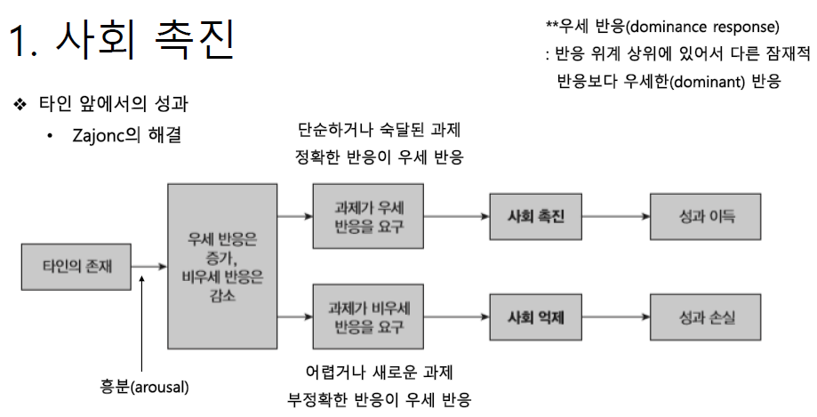
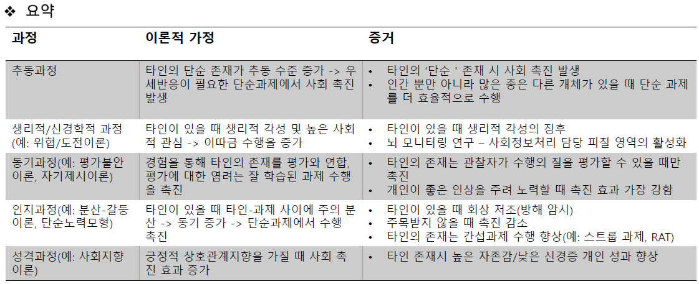
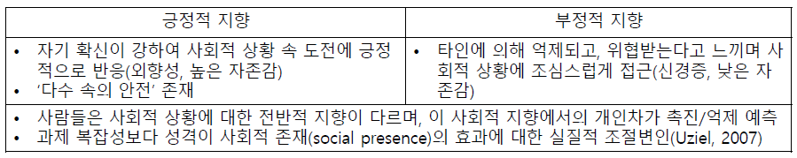
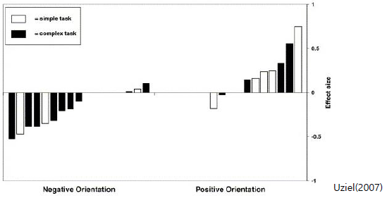
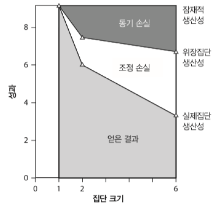
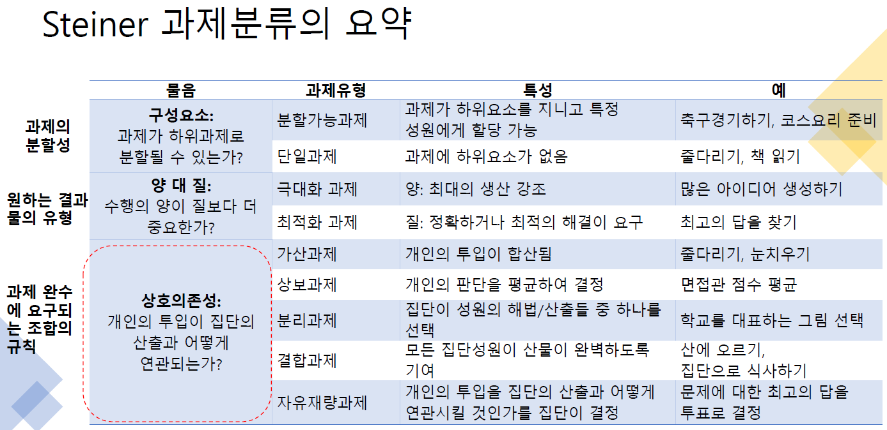
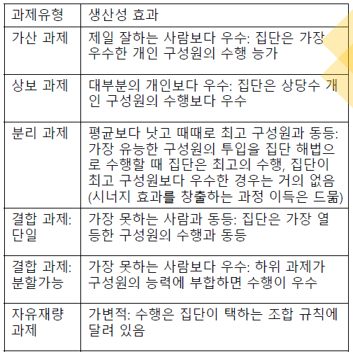

# 수행
## 사회 촉진 (Social facilitation)
### 타인 앞에서의 성과: Zajonc  

  
<br><br>

### 사회 촉진이 일어나는 이유
  

1. 추동 과정
    - 관찰자의 단순 존재만으로도 촉진/억제 발생(Schmitt et al., 1986)
    - `흥분 유발 -> 우세반응 활성화`
2. 생리적 과정
    - `위협/도전 모형(Blascovich et al., 1999)`: 어려움이나 문제 극복을 확신할 때 도전 반응 / 과제가 어려울 때 위협, 스트레스 반응
3. 신경학적 과정
    - `사회적 뇌 (배외측 전전두엽 피질)`: 사회적 뇌의 주의/보상센터 활성화 -> 단순과제에서 성과 촉진, 복잡과제에서 성과 방해
    - 생리적 과정(심박수, 혈압 등)은 수행에 거의 영향을 미치지 않으며, 타인의 존재에 과잉반응하는 것은 뇌이지 심장이 아니라는 주장(ito et al., 2011)
4. 동기적 과정
    - `평가불안이론(evaluation apprehension theory)`
        - 흥분(arousal)이 아니라 미래의 보상, 처벌 불안감이 사회촉진 효과의 근원
        - 사회적 접촉에 대한 개인의 과거 경험에서 타인이 평가의 원천임을 학습 (타인의 평가에 대한 일반적 염려가 과제 수행 촉진/억제)
    - `자기제시이론(selg-presentation theory)`
        - 단순과제: low 실패 확률 -> 긍정적 자기제시 동기 증가 -> 수행 증진
        - 복잡과제: 당혹감 예상 -> 스트레스, 인지간섭 -> 수행에 지장
5. 주의 과정
    - `주의분산-갈등 이론`: 타인의 존재는 과제 집중 방해 (주의 분산)
        - 단순과제: 집중 방해량 < 극복 노력에 의한 집중량 (간섭효과 상쇄)
        - 복잡과제: 집중 방해량 > 극복 노력에 의한 집중량 (간섭효과 발생)
6. 인지 과정
    - `단순노력 모형` (mere-effort model, or threat-induced potentiation of prepotent responses model)
        - 성과 변화는 정보처리 방식의 변화에 기인
        - 타인 존재 시 더 노력 -> 쉽게 접근 가능한 정보에 집중, 당면 과제와 관련이 있을 때 촉진 발생 / 관련 없는 정보의 접근가능성이 높을 때 성과 방해
        - 단순/복잡 RAT 검사: 복잡한 문항에 응답 시에는 마음에 쉽게 떠오르는 가까운 연관을 넘어서야 함
7. 성격 과정
    - `사회지향 이론(social orientation theory)`
        - 사회적 상황에 대한 전반적 지향이 사람마다 다름  

    
      

## 사회 태만
### `링엘만 효과`  
- 집단 크기가 증가함에 따라 집단 효율성 감소 현상  
- 집단 생산성 손실
    - `조정의 손실`: 노력의 동시성 결여로 잠재적 생산성에 도달 못 함 (여러 개의 손은 일을 쉽게 만든다)
    - `동기 손실`: 사회태만 (혼자보다 집단작업 시 노력을 덜 함)

  

### 사회 태만
원인
```
- 식별불가능성: 평가 염려 감소(책임감 분산), 수행에 대한 유인가 감소(개인 노력에 대한 지각된 효율성 감소)
- 무임승차: 다른 성원이 보충할 것
- 귀인과 형평: 호구효과(sucker effect), 남이 무임승차할 때 나만 열심히 하면 호구가 된다
- 문화차이, 집단 특성, 생산성 착각 등
- 집합적 노력 모형(CEM; collective effort model): 집단 과제에서는 노력-성공 가능성의 연과성이 모호, 집단 성공과 개인 이득 연관성 낮음
```

치료
```
- 식별 가능성 높이기
- 무임승차의 최소화 (e.g. 역할 증진, 소집단으로 수행집단 구성)
- 목표 설정: 구체적, 도전적
- 과제 몰입도
    - 사회보충 현상(social compensation effect): 다른 성원의 노력/능력이 불충분하다고 느낄 때 이를 상쇄하기 위해 더 큰 노력을 쏟음
- 집단정체성 증가: 집단 동일시 정도 증가시키기
```

## 집단에서 일하기

- 집단 성과의 과정 모델
    - AP = PP - PL
        - AP: actual productivity
        - PP: protential productivity
        - PL: `process loss` (집단이 경험하는 모든 `과정 손실`)
    - 집단수행은 `과제요구, 자원, 과정`에 따라 결정됨  

  

- 가산 과제 (additive task)
    - `분할과제, 극대화 과제` (개별 성원의 투입을 합하여 완수하는 과제) -> 조정 요구 최소화
    - `대다수의 개인, best member < 집단`
    - 성원 수 증가에 따라 과정손실 증가 (`e.g. 링엘만 효과`)
- 상보 과제 (compensatory task)
    - 집단이 개별 성원들의 해결책이나 제안을 평균하여 완수하는 과제 (e.g. 투표)
    - `wisdom of crowd`
    - 집단이라서 우수한 것이 아니라 여러 번 추정하는 과정을 가지는 것이 정확도를 높임
- 분리 과제 (disjunctive task)
    - `단일과제, 최적화 과제` (집단의 성과로 대변될 하나의 해결책 생성) -> 집단 성과가 주로 best member 수행 수준에 의해 결정
    - `대다수의 개인 < 집단 <= best member`
    - 집단이 클수록 정답 제시 확률 증가
    - `Eureka과제(지적 과제)`: 명백한 답이 있는 과제
        - "truth-wins" rule 적용
        - BM에 의해 집단성과 결정
        - 집단의 정답 수용이 쉬움
    - `비Eureka과제(판단 과제)`: 평가적 판단이 요구되는 과제
        - "truth-supported-wins" rule 적용
        - 집단의 정답 수용이 어려움
- 결합 과제 (conjuctive task)
    - 모든 성원의 완성 수준에 따라 집단 수행이 결정되는 과제
    - `IGM(the most inferior group member)`에 의해 집단 수행 결정
    - IGM에게 가장 쉬운 과제를 부여함으로써 집단 성과 향상 가능
    - `쾰러 효과`: IGM은 굴욕적 -> 열심히 수행 -> 동기 이득
- 자유재량 과제 (Discretionary task)
    - 구성원들이 투입을 어떻게 결합할 것인가를 결정 - 가변적
    - e.g. 가산과제, 분리과제, 각 성원의 기여도를 비중을 달리하여 조합

  

###### '과정손실' 최소화가 집단생산성에 중요 (집단구성원의 동기 최대화, 조정손실 최소화)

- 집단의 과정 이득 (시너지)
    - 상당히 드물게 발생
    - 구성원의 기초 숙련 수준이 높고 그것들을 구분하는 `인지적 거리(cognitive distance)`가 적정 수준일 때 (각자의 전문분야가 있고 분야에 약간의 차이가 있을 때)

## 집단 창의성
- 브레인스토밍
    - 표현하기 (be expressive)
    - 평가 연기 (postpone evaluation)
    - 양 (quantity)
    - 얹혀가는 아이디어 (piggyback idea): 가능한 한 타인의 생각을 변형, 확장하려고 시도
- `명목집단(nominal group)`
    - 개인들이 혼자 작업한 다음 생산물 합침
    - 브레인스토밍 집단보다 아이디어 양과 질 높음
    - 이유: 과정손실  
        - 사회적 태만
        - 생산성 억제 (차례 기다림, 주의분산)
        - 평가 불안
        - 사회 부합 (비교과정 통해 수행 수준을 맞춤)
        - `집단생산성의 착각` (비현실적으로 긍정적 집단산출 양/질 지각)