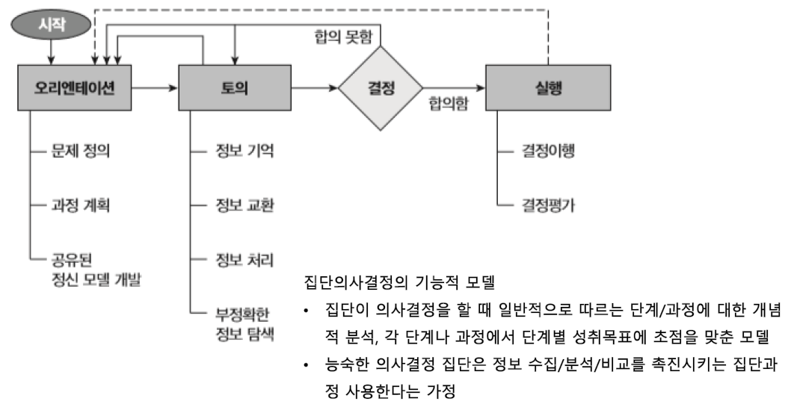
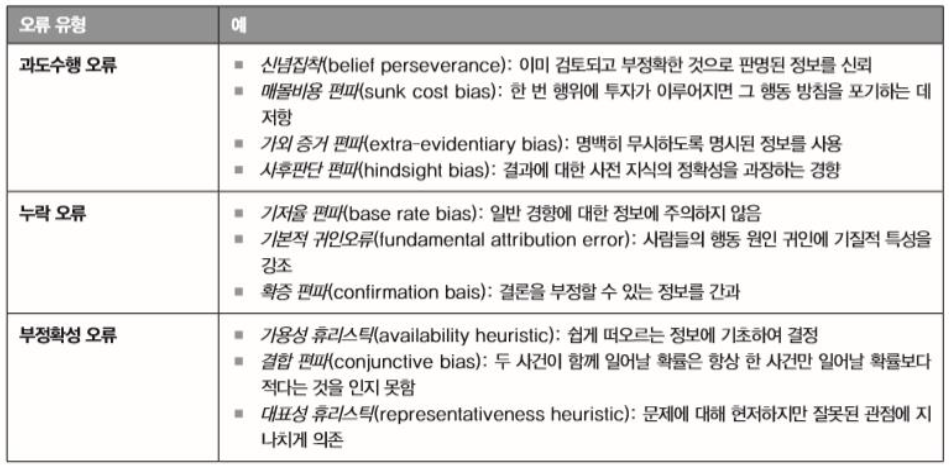
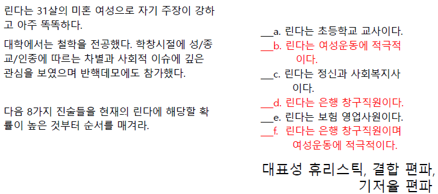

# 의사결정
피그만 침공 사건 (케네디 대통령 "어떻게 그리도 어리석을 수 있었는지..." 개탄)

## 의사결정 과정
  

### 오리엔테이션
- `공유된 정신 모델(shared mental model)` 개발: 집단 성원들이 공통적으로 지니는 인지적 표상(representation)
    - 구성원들이 과제/목표/고정에 대해 동일한 개념을 수용할 때, 집단의 최종 선택은 `개인적 편파`가 아니라 `집단 선호 반영` 가능
- 목표 명확성, 목표경로 명확성
- 계획
    - 초기 단계 시간 할애 -> 엄격한 규범 발달 -> 성과 향상
    - `반계획 편향`: 계획활동이 수행활동보다 덜 중요하다고 믿는 것 -> `계획 오류` 발생
### 토의
- 주요 과제
    - 집합적 기억: 개인보다 집단 기억이 더 큰 용량, 오랜 시간 지속
    - 정보교환: 개인보다 집단이 더 많은 정보 보유
        - `교차단서` 주기를 통해 상대방 기억 자극 (잘못된 단서는 기억 방해)
        - `교류기억체계`를 만들어 타구성원 기억 활용 (e.g. CIA의 오판으로 인해 쿠바 침공 실패)
    - 정보처리
    - 오류 감지 및 수정
- 토의의 어려움
    - 집단은 잘 잊는다 
        성원들의 무임승차/태만, 집단장면의 복잡성
    - 집단 구성원들은 오해한다
        - `평준화(level)`: 단순화 및 간략화
        - `첨예화(sharpen)`: 화자에 의해 꾸며진 차이
        - `동화(assimilate)`: 개인적 기대와 신념에 일치되도록 메시지 해석
    - `Parkinson의 법칙`: 과제완성에 사용할 수 있는 시간/인원을 채우기 위해 일을 확장
    - `사소함의 법칙`: 안건 논의를 위해 집단이 소비하는 시간은 안건 중요성에 반비례 
    - 의사결정 저해전략(Janis&Mann, 1977)
        - 지연, 고집, 책임부정, 시간끌기, 만족하기, 토론 김 빼기

### 결정
- `사회결정도식(social decision scheme)`: 여러 대안들로부터 하나의 단일 대안을 선택하는 (명시적/암묵적) 전략/규칙
    - 위임, 평균화, 다수결, 만장일치, 무작위 결정

### 실행
- 절차적 정의
    - 의사결정시 절차적 공정성 확보될 때 실행 단계에서 더 성공적
    - 공정한 절차(레벤탈 규칙)
        - 일관성의 원칙
        - 편견억제의 원칙
        - 정확성의 원칙
        - 수정 가능성의 원칙
        - 대표성의 원칙
        - 윤리성 원칙

## 의사결정 오류
### 판단 오류
집단은 편파를 억제X 증폭O
1. 과도수행 오류 (정보 오용 e.g. 허위 정보에 근거한 판단 지속)
2. 누락 오류 (정보 간과)
3. 부정확성 오류

- `확증편파`: 자신의 추론을 확인시키는 정보를 아닌 정보보다 더 추구하는 현상
    - 초기 선호를 공개적으로 말하지 않도록 하면 감소
    - 주제에 대해 다양한 소수 입장을 가진 사람들을 토의에 포함시키면 감소  

  
  

### 공유 정보 오류
- 집단의 논의 시작 전 다수 구성원이 알고 있었던 정보는 소수 구성원이 알고 있었던 정보보다, 내용의 타당성과 관계 없이 판단에 더 큰 영향력 행사
- 비공유정보의 비중이 중요한 사안에서 공유정보 의존은 비효과적 (숨겨진 특성 발견 불가)
    - `비공유정보`: 정보적 가치 but 합의 달성 측면 걸림돌
    - `공유정보`: 규범적 영향 but 정보적 가치는 없음
- 공유정보의 편파 방지 방법
    - 경험 많은 구성원이 비공유 정보에 주목
    - 토론시간이 길 때 (일반적 논의 순서: 공유정보 -> 비공유정보)
    - 집단 내 상이성 증가시킬 때 (일반 토론보다는 지원자 역할 이용)

### 집단 극화

## 집단사고의 희생자

