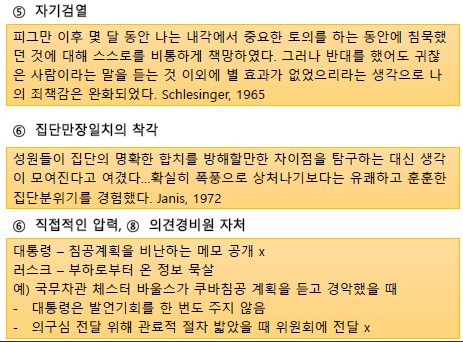

# 의사결정
피그만 침공 사건 (케네디 대통령 "어떻게 그리도 어리석을 수 있었는지..." 개탄)

## 의사결정 과정
  

### 오리엔테이션
- `공유된 정신 모델(shared mental model)` 개발: 집단 성원들이 공통적으로 지니는 인지적 표상(representation)
    - 구성원들이 과제/목표/고정에 대해 동일한 개념을 수용할 때, 집단의 최종 선택은 `개인적 편파`가 아니라 `집단 선호 반영` 가능
- 목표 명확성, 목표경로 명확성
- 계획
    - 초기 단계 시간 할애 -> 엄격한 규범 발달 -> 성과 향상
    - `반계획 편향`: 계획활동이 수행활동보다 덜 중요하다고 믿는 것 -> `계획 오류` 발생
### 토의
- 주요 과제
    - `집합적 기억`: 개인보다 집단 기억이 더 큰 용량, 오랜 시간 지속
    - 정보교환: 개인보다 집단이 더 많은 정보 보유
        - `교차단서` 주기를 통해 상대방 기억 자극 (잘못된 단서는 기억 방해)
        - `교류기억체계`를 만들어 타구성원 기억 활용 (e.g. CIA의 오판으로 인해 쿠바 침공 실패)
    - 정보처리
    - 오류 감지 및 수정
- 토의의 어려움
    - 집단은 잘 잊는다
        - 성원들의 무임승차/태만, 집단장면의 복잡성
    - 집단 구성원들은 오해한다
        - `평준화(level)`: 단순화 및 간략화
        - `첨예화(sharpen)`: 화자에 의해 꾸며진 차이
        - `동화(assimilate)`: 개인적 기대와 신념에 일치되도록 메시지 해석
    - `Parkinson의 법칙`: 과제완성에 사용할 수 있는 시간/인원을 채우기 위해 일을 확장
    - `사소함의 법칙`: 안건 논의를 위해 집단이 소비하는 시간은 안건 중요성에 반비례 
    - 의사결정 저해전략(Janis&Mann, 1977)
        - 지연, 고집, 책임부정, 시간끌기, 만족하기, 토론 김 빼기

### 결정
- `사회결정도식(social decision scheme)`: 여러 대안들로부터 하나의 단일 대안을 선택하는 (명시적/암묵적) 전략/규칙
    - 위임, 평균화, 다수결, 만장일치, 무작위 결정

### 실행
- 절차적 정의
    - 의사결정시 절차적 공정성 확보될 때 실행 단계에서 더 성공적
    - 공정한 절차(레벤탈 규칙)
        - 일관성의 원칙
        - 편견억제의 원칙
        - 정확성의 원칙
        - 수정 가능성의 원칙
        - 대표성의 원칙
        - 윤리성 원칙

## 의사결정 오류
### 판단 오류
집단은 편파를 억제X 증폭O
1. 과도수행 오류 (정보 오용 e.g. 허위 정보에 근거한 판단 지속)
2. 누락 오류 (정보 간과)
3. 부정확성 오류

- `확증편파`: 자신의 추론을 확인시키는 정보를 아닌 정보보다 더 추구하는 현상
    - 초기 선호를 공개적으로 말하지 않도록 하면 감소
    - 주제에 대해 다양한 소수 입장을 가진 사람들을 토의에 포함시키면 감소  

  
  

### 공유 정보 오류
- 집단의 논의 시작 전 다수 구성원이 알고 있었던 정보는 소수 구성원이 알고 있었던 정보보다, 내용의 타당성과 관계 없이 판단에 더 큰 영향력 행사
- 비공유정보의 비중이 중요한 사안에서 공유정보 의존은 비효과적 (숨겨진 특성 발견 불가)
    - `비공유정보`: 정보적 가치 but 합의 달성 측면 걸림돌
    - `공유정보`: 규범적 영향 but 정보적 가치는 없음
- 공유정보의 편파 방지 방법
    - 경험 많은 구성원이 비공유 정보에 주목
    - 토론시간이 길 때 (일반적 논의 순서: 공유정보 -> 비공유정보)
    - 집단 내 상이성 증가시킬 때 (일반 토론보다는 지원자 역할 이용)

### 집단 극화
- 부정적 결과 e.g. 존슨 행정부의 베트남전 확전, 일본의 진주만 침공 결정, 피그만 참사
- `모험이행현상(risky-shift phenomenon)`
    - 집단이 개인보다 더 모험적인 것으로 결정
    - `집단극화`: 집단 의사결정 시 성원들이 각자 선호하던 관점의 평균과 비교해서 방향은 동일하지만 더 극단의 선택이 이루어지는 현상
- 원인
1. 사회비교
    - 타인 = 자신의 선호/입장을 평가하는 기준점
    - 상향추구경향 (자기 의견을 집단 쪽으로 변화)
    - 집단이 토의과정을 거치지 않더라도 성원들의 의견 분포를 알기만 하면 사회비교 과정을 통해 선택 이행이 발생
2. 설득주장
    - 설득을 통한 태도변화과정 중시
3. 사회정체성
    - 지각된 전형적인 구성원의 의견 쪽으로 수렴/합치
    - 외집단과의 구별 위해 극단적 방향으로 극화

## 집단사고의 희생자
집단사고(groupthink): 집단 성원들이 응집력이 강한 내집단에 깊이 관여하고, 만장일치 분위기가 팽배하여, 다른 애단을 현실성 있게 평가하려는 동기를 억압하여 생기는 사고 유형 (Janis, 1982)
- 집단사고의 증상
1. 집단과대평가
    - `불패의 착각` (집단에 취약성이 없다는 착각, 극단적 자신감/확신감)
    - `도덕성 착각` (집단의 도덕성에 대한 믿음, 분별심 상실)
2. 닫힌 마음
    - `집단적 합리화` (-> 초기 결정 강화)
    - `외집단에 대한 고정관념`
3. 합치로의 압력  
    부동조자 처벌 (비판 금기 규범 형성)
    - `자기검열` (반대의견 있어도 스스로 억압)
    - `집단만장일치의 착각`
    - `직접적인 압력`
    - `의견경비원 자처` (집단의식 수준에 도달하기 전 반대자 억제)

  

- 잘못된 의사결정 증상
    - 대안적 해결책 검토 불충분
    - 목표 검토 불충분
    - 선호된 선택이 지니는 위험 검토 부재
    - 초기에 배척된 대안 재평가 부재
    - 정보탐색의 빈약성
    - 입수한 정보 처리 시 선택의 편파성
    - 우발적으로 발생할 사건에 대한 계획 미수립

- 집단사고의 원인
    - `높은 응집력`
    - 집단이나 조직의 `구조적 결함`  
        e.g. insulation(고립, 밀실결정), 폐쇄적 리더십
    - 도발적 `상황 맥락` (결정 스트레스)

- 대안적 모델
    - `집단중심주의 이론`(Kruglansk et al., 2006)
        - 집단 단일성 유지/지원에 대한 구성원의 과도한 노력
        - 인지적 종결(cognitive closure) 추구
        - 권위적 리더, 중앙화된 구조 수용
    - `사회정체성과 편재성 모델`(Baron, 2005)
        - 집단사고 증상 증가 원인은 집단단일성 자체가 아니라 집단 실패 시 발생될 공유된 사회정체성에 대한 위협
        - 토의 주제에 대한 구성원 의견을 제재하는 규범 발달
        - 구성원의 자신감 결여

- 집단사고의 예방
    - 조급한 합의 추구 억제
        - 리더는 조용히, 개방적 토의 분위기
        - the devil's advocate 지정 운용
        - multiple groups 활용
    - 오해와 편파 수정
        - 결정의 불완전성, 낙관성의 위험 인식
        - 무지/부족함 인정, 증거중심주의
    - 효과적 의사결정 기법 사용
