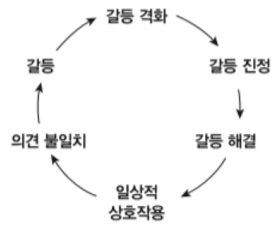
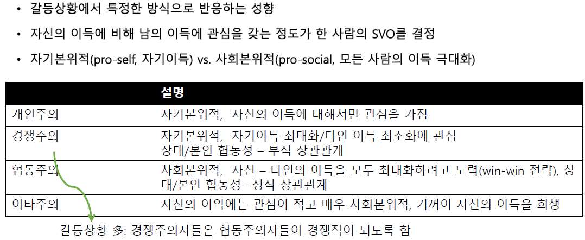
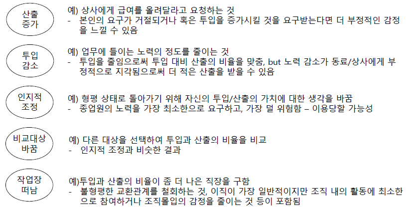

# 갈등
  

## 갈등의 근원
### 승리하기: 갈등과 경쟁
집단의 특징: 상호의존성
- 증진적 상호의존관계: 협동 (성공-성공)
- 저해적 상호의존관계: 경쟁 (성공-실패)

1. `혼합동기갈등`
- 혼합동기상황: 경쟁적이면서 협동적인 목표 구조를 갖는 업무 수행 상황
- `죄수의 딜레마 게임(PDG)`
    - 고전경제학: 인간 = 합리적/이기적인 자기이익의 추구자
    - 프레임에 따라 행동패턴 달라짐  
        e.g. 월 스트리트 게임 vs 공동체 게임
        e.g. 적 vs 파트너
    - 동일 상대와 게임을 여러 번 시행할 것이라는 사실을 알 때 협동 증가
    - PDG 여러 번 시행 시 `행동동화` 발생
        - 상호성의 표현 (눈눈이이)
        - 부적 상호성이 정적 상호성보다 강력
2. `사회적 가치관` (`SVO`; social values orientation)  

### 공유하기: 자원갈등
1. `공동자원 딜레마`(commons dilemma)
    - 무료 공동자원을 자기 몫 이상 가져감 -> 자원고갈(공동의 파멸)
    - e.g. 공동목초지(tragedy of commons)
2. `공공재화 딜레마`(public goods dilemma)
    - 자기 몫을 하지 않아 공공재화가 제공되지 않는 공동의 파멸 상황
    - 호구효과, 무임승차
3. `공정성 딜레마`
    - `분배공정성`: 나는 정당한 몫을 받았는가?
        - 비례규범, 평등규범, 필요규범
    - `절차공정성`: 구성원으로서의 지위 인정과 집단 자부심은 분배적 정의보다 절차적 정의에 의해 더 크게 좌우됨
    - `상호작용 공정성`: 교환관계에서 존중/대우받는지
    - 투입 대 산출 비율 균형/불균형 -> 과소지급/형평상태/과대지급
      
4. `책임감 딜레마`: 성공/실패의 책임 소재
    - `자아중심주의`: 일반적으로 각 구성원은 다른 구성원보다 공로가 많다고 생각 (타인의 기여보다 나의 기여가 잘 보이기 때문 -> `결체 분해(unpacking)`)
    - 집단고양행동: "우리 모두가 해냈어"
    - 개인고양행동: "내가 아니면 못 했지

### 통제하기: 권력갈등
Power game 과정에서 갈등 야기

### 일하기: 과업갈등과 과정갈등
- `과업 갈등: 실제적 갈등` (아이디어, 의견, 해석 상충)
- `과정 갈등: 절차적 갈등` (전략, 정책, 방법 상충)
    - 절차상의 혼선/갈등 최소화 위해 내규/규약/정책문서/절차문서 등 명세화

### 호감과 반감: 인간적 갈등
- 개인적 반감에 의한 갈등
- (유사성 -> 호감)(상이성 -> 반감)
    - 다양성(이질성)은 가용자원/관점풍부 장점 but 갈등 가능성이 크다는 단점

## 대치와 격화
[상세내용](./CH13.pdf)
|대치|격화|해소|
|:---:|:---:|:---:|
|불확실|고집|협상|
|지각|오해|이해|
|연성책략|강성책략|협동책략|
|상호성|보복|용서|
|소수|다수|소수|
|자극|분노|평정|  
