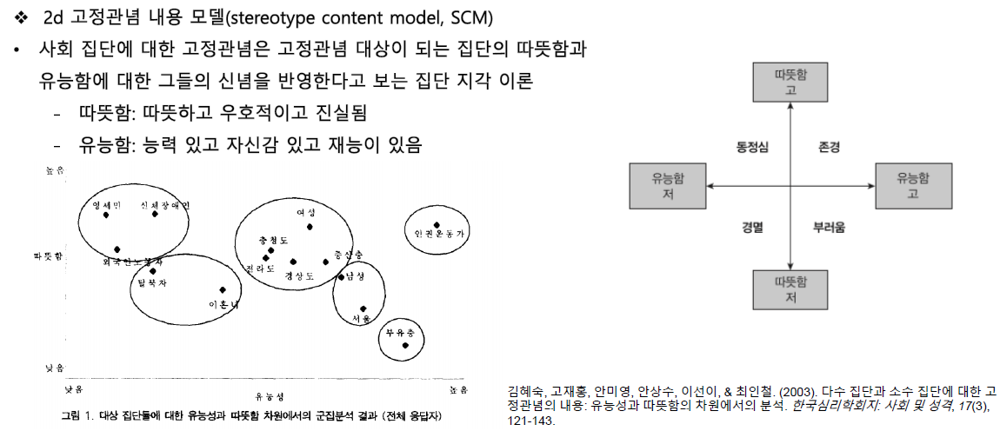
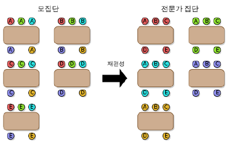

# 집단 간 관계
`Robbers Cave 실험`: 두 집단 무선 배정  
-> 1주 간 완전 분리 생활 (응집성 증가)  
-> 우연히 상대 집단 존재 발견, 저절로 경쟁 상태 돌입, 경쟁 심화  
"같은 버스에 타도 된다는 말을 듣자 일부는 함성을 지르기도 하였다. 버스가 출발하다 좌석에는 집단 간의 구분이 없었다. 많은 소년들이 야영장을 뒤돌아 보았고 독수리팀의 Wilson은 캠프가 끝났다고 울음을 터뜨리기도 하였다. (Sherif et al., 1961)"

## 집단 간 갈등: 우리 대 그들
### 경쟁과 갈등
- `현실적 집단갈등 이론 (realistic group conflict theory)`
    - 집단 간 갈등은 제한된 자원에 대한 경쟁으로부터 야기
    - 경쟁 예견만으로도 집단 간 적대감 증가, 내집단 동일시/긍정적 애착 유발
- cf. 사회정체성 이론
    - 내집단 동일시 강조
    - 계층화된 사회에서 객관적 자원 분배가 균등하지 않으면 우월-열등 집단 간 적대감 심화
- `불연속 효과 (discontinuity effect)`
    - 개인에 비해 집단 간 현저히 더 큰 경쟁성을 보임
    - 협조를 선호하는 개인들도, 집단 합류 시 경쟁 지향으로 대체
      

    - 불연속의 원인
        - 욕심
        - 공포: 집단 간 피해망상
        - 내집단 편애: 집단의무감 발생(내집단 이익 추구)
        - 책임 분산
        - 집단의 과도한 경쟁을 줄이는 비효과적 방법
            - 의사소통: 부정적/잘못된 정보 교환
            - 유화적 접근: 집단의 경우 상대가 경쟁적일 때 협조적으로 대하면 상대 집단은 평화 집단에 착취로 응함
                - TFT(Tit for Tat)가 효과적
                - 경쟁이득 및 구성원 익명성 감소

### 권력과 지배
- `사회지배성 이론`
    - 자원분배가 실제로 불공평함을 부정, 한 집단이 다른 집단을 지배하는 것이 자연 법칙에 부합한다고 주장
    - `사회지배성향`(`SDO`; social dominance orientation): 사회지배성에 개인차 존재, 자기 집단 이익 극대화를 위해 노력
- 지배성의 부패 효과
    - `인스코의 소사회 연구`
        - 경제적 권력 조건: 한 집단이 더 다양한 제품 생산(흥정/교역 우위)
        - 강압적 권력 조건: 다른 집단으로부터 원하는 제품 압수 (-> 어떤 집단도 높은 생산성X)

### 집단 간 공격성
- 분노와 보복: `좌절-공격 가설`  
    좌절/욕구불만 -> 긴장 발생 -> 배출구 탐색 -> 공격/보복 -> 일반 공격 모델
- 희생양 과정: `희생양 이론`
    - 가해집단이 자신보다 강할 때 욕구불만의 원천과 상관 없는 약한 집단 공격
    - 집단수준 희생양 발생 시, 집단 전체가 자신들의 문제를 비난할 특정 대상 집단 선택

### 규범과 갈등
- 상호성 규범: 눈눈이이, 갈등심화의 상승모형
- 문화 규범: 명예 문화, 품위 문화, 체면 문화
- 집단 규범

### 진화적 관점
- 사회적 뇌 가설, Dunbar's number
- 내부자/외부자 구분 못 하는 사람은 생존가능성이 적음

## 집단 간 편파: 우리와 그들의 인식
### 갈등과 범주화
- 사회적 범주화(social categorization)
    - 진화적으로는 적응적이나, 갈등의 인지적 토대 제공
    - 내집단/외집단 분류 시 평가적 편파 발생

### 내집단-외집단 편파
- 내집단 긍정성과 외집단 부정성
    - 함께 발생 but 많은 집단간 갈등에서 외집단 배척보다는 내집단 선호가 더 강하게 나타남
- `이중 잣대 사고`
    - 이중잣대로 내/외집단 평가
    - 위협적 조치에 대해 자국인 경우는 위부 귀인, 타국인 경우는 내부 귀인
- 암묵적 집단 간 편파
    - `암묵적 연합검사`(`IAT`; implicit association test)
        - 내집단/친절한, 외집단/나쁜과 같은 직관적 인상에 부합하는 경우 빠르고 정확하게 반응
        - 내집단/나쁜, 외집단/친절한과 같은 경우 더 늦게 반응
        - 모든 유형의 사회적 범주를 사용해도 같은 결과 도출

### 인지적 편파
- `외집단 동질성 편파`
    - 외집단 성원들은 서로 매우 유사하고, 내집단 성원들은 더 상이하다고 지각하는 경향
    - 상당 경우 약자집단은 동질적, 강자집단은 다양성이 있는 집단으로 봄
    - 극단적 갈등상황 하에서는 내집단원/외집단원 동질성 지각이 동시 발생
- `집단 귀인 오류` (편파적 지각)
    - 한 개인의 특성을 전체 집단의 일반적 특성으로부터 추론할 수 있다는 가정
    - 다수가 보이는 행동을 소수의 행동으로부터 정확하게 추론할 수 있다는 가정 (`소수의 법칙`)
- `궁극적 귀인 오류` (UAE; ultimate attribution error)
    - 외집단: 부정적행위 내부귀인, 긍정적행위 외부귀인
    - 언어적 집단 간 편파  
        ||긍정적 행동|부정적 행동|
        |:---:|:---:|:---:|
        |내집단원|추상적|구체적|
        |외집단원|구체적|추상적|  
- `고정관념`: 인지적 일반화 (공유된 사회적 신념)
    - 신속한 파악 가능, 인지적 노력을 줄여줌

### 고정관념 내용 모델
  

### 배제와 비인간화
- `집단 증오`
    - 개인은 다른 사람에게 화낸 것을 후회하지만, 집단 수준에서는 그런 후회를 느끼지 않음
- `도덕성 배제` (moral exclusion)
    - 상대가 도덕적으로 권리/보호를 받을 자격이 없다고 여기게 되는 것 (e.g. 유태인 학살, 인종 청소)
    - 폭력의 원인을 피해자에 귀인함으로써 함리화
    - 공격 강도가 증가할수록 상대방을 더 평가절하 (도덕적 관심 대상에서 제외)
- `비인간화` (dehumanization)
    - 동물과 구분되는 인간으로서의 외집단의 자질을 부인할 때 나타남 -> 외집단에 대한 혐오
    - fMRI 연구 결과: 극단적인 외집단(노숙자, 마약 중독자 등)의 그림을 볼 때 `내측 전두엽 피질(사회적 정보처리에 반응하는 영역)의 신경활동이 휴식상태를 넘지 못함`

### 범주화와 정체성
- 자기 가치감 욕구 높은 사람들이 외집단에 가장 부정적 경향 보임
    - 자존감 상승 위해 내집단 편파 강해짐
    - 집단 내 낮은 지위의 주변적 구성원들이 자기 집단 방어와 외집단 거부에 가장 열정적

## 집간 간 갈등 해소: 우리와 그들의 통합
### 집단 간 접촉
- `접촉 가설(contact hypothesis)`: 접촉을 통한 편견 감소 (일정 규제 필요)
    - 평등한 지위
    - 공동의 목표: 합동과제 포함
    - 협동: 과제는 높은 수준의 상호의존성 요구해야 함
    - 권위자/법/관습의 지원: 상황 규범에 대한 명백한 지지
- 접촉과 `상위목표(superordinate goal)`
    - Sherif 실험에서 식수 공급선 고치기
    - `우정`: 비공식적, 사적 상호작용 촉진 필요
        - `연장된(extended) 접촉 가설`: 간접적 친구관계여도 적대감 감소
    - `성공`: 실제 목표에 도달할 경우 더 효과적, 실패 시 외집단 탓으로 갈등 심화
    - `시간`: 오랜 시간에 걸친 협조적 집단 접촉 필요

### 갈등의 인지적 치유
  

### 협력 배우기
- `조각 맞추기(jigsaw method)` 
    - 구성원 모두의 기여가 필수적인 과제
    - 학습집단 구성 -> 학습 단위 배분 -> 각 하위 주제에 대한 전문가가 되어 집단의 다른 구성원에게 가르침
    - e.g. 정부(사법부, 행정부, 입법부)  
      
- 갈등관리 기술 훈련 프로그램 (e.g. Johnson&Johnson, 2009)
    - 각 구성원이 기여할 수 있도록 과제 구성
    - 집단 내 역할에 학생들을 무작위로 배정
    - 합쳐질 모든 집단에서 동일한 수의 집단 대표자를 포함
        - 갈등의 정의
        - 갈등의 본질에 대한 정보 교환
        - 여러 각도에서 상황을 조망
        - 갈등 해결 방안 모색
        - 모든 당사자가 이익을 볼 해결 선택
