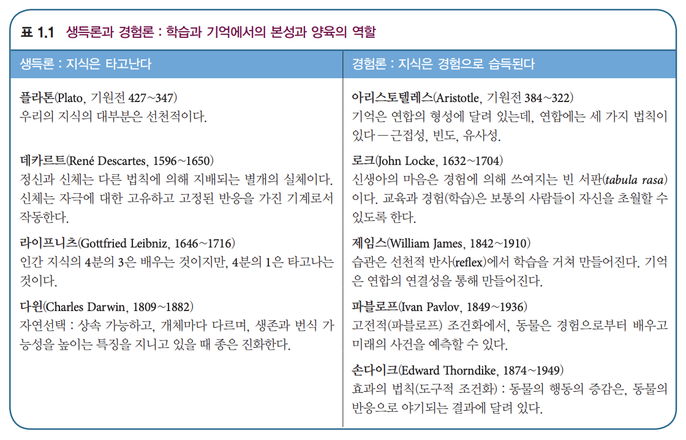

# 학습과 기억의 심리학

## 1. 개념

- `학습(learning)`: 세상과 상호작용하여 행동의 변화를 일으키는 `과정(process)`
- `기억(Memory)`: 학습을 통해 얻는 과거경험의 `기록(recording)`

## 2. 역사

  

### 철학
|||
|:---:|:---|
|아리스토텔레스|**Nurture** 경험주의 (<-> 플라톤 생득설)   연합주의 - 연합의 세 법칙: contiguity(근접성), frequency(빈도), similarity(유사성)|
|데카르트|**Nature** 이원론   인간을 최초로 기계로 봄 (신체는 마음과 별개, 외부 자극으로 작동하는 자동기계)|
|존 로크|**Nurture** 연합주의   감각기관을 통해 수동적으로 얻어진 기본관념들의 결합 -> 복합관념   모든 지식은 오직 경험에서 기인함 (화학자 보일의 영향)   최초로 신을 배제하고 인간을 바라봄 (종교개혁의 영향)|
|윌리엄 제임스|**Nurture** 연합주의   블랙박스 - 과학적 심리학의 시작|  

### 과학
|||
|:---:|:---|
|찰스 다윈|진화는 유전자의 전승일 뿐, 그 다음 세대의 획득된 특성은 다음 세대에 전달되지 않음   즉 학습된 지식이 진화하는 것이 아님, 유전되는 것은 생존 확률을 높이는 특정 학습과 기억 능력 그 자체이며, 행동의 진화는 자연선택임|
|프랜시스 골턴|우생학 창시   normal distribution, hypothesis, correlation study, confound, eugenics|  

- 후생유전학
	- 이미 결정된 유전자도 후생 요인(환경적 요인)에 의해 발현될 수도, 안 될 수도 있음
	- Nurture에 대한 가능성 증폭

### 심리학
|실험심리학|변수에 조작을 가하여 가설 검증|
|:---:|:---|
|에빙하우스|현대 기억연구의 아버지   망각곡선, 간격효과(분산학습이 더 효율적임)|
|파블로프|동물학습 연구방법 개발   정성적X 정량적 기록O -> 과학적 심리학의 태동   `Classical Conditioning (고전적 조건화)` - 두 자극의 연합   공포조건화 (학습곡선, 소거, 일반화)   연합학습 (두 자극(사건)을 연합 -> 하나의 자극이 다른 자극을 예측할 수 있게 해줌)|  
|손다이크|`Operant Conditioning (도구적/조작적 조건화)` - 반응과 결과의 연합   Law of effect (효과의 법칙 - 보상받은 행동은 재발 가능성 높음) - Puzzle Box|

- 피험자 편향 (subject bias) -> 맹목설계 (blind design) -> 실험자 편향 (experimenter bias) -> 이중맹목설계 (double-blind design) e.g. 플라시보(placebo) 실험  

|행동주의 심리학|`S-R Learning` (SRO -> 학습)|
|:---:|:---|
|왓슨|`미로 학습` (쥐), 유기체는 기계와 같다   input (stimulus) -> output (response)|
|클라크헐|수리적 모형으로 인간의 행동을 예측할 수 있다|
|스키너|집대성, 매우 급진적인 행동주의 학자   `Skinner Box` - 간헐적 보상   적절한 보상/처벌로 모든 유기체를 학습시킬 수 있다고 주장|  

- 심리학은 `관찰 가능한 행동 연구`(측정 가능한 신체적 활동)에 집중해야 하며, 관찰 불가능하고 잘 정의되지 않은 정신적 사건 연구(의식, 의도, 생각 등)는 멀리해야 함
- “순전히 객관적 실험을 하는 자연과학의 한 분야가 되어야 하며, 심리학의 이론적 목표는 행동을 예측하고 통제하는 것이 되어야 한다.” (Watson, 1913)

|인지심리학|Attention -> 학습|
|:---:|:---|
|톨만|`Cognitive Map (인지도)`   행동을 보면 목적을 알 수 있음   잠재학습 - 미로에서 놀면서 익숙해진 쥐들이 3일 이상 빠르게 학습함을 발견 (단순 노출만으로도 학습에 영향)|
|에스테스|조건화된 정서 반응 (Conditioned emotional learning) 패러다임 고안   수학적 심리학 (학습의 무선적 현상, 일반화 -> 자극 표집 이론으로 설명)|
|고든 바우어|통찰학습   `Ah-ha Experience` (one-step model), 피질|
|조지 밀러|정보이론   magic number 7 (+- 2)   정보처리의 수학적 모형 - 정보의 크기는 수신자(의 사전지식)에 따라 다름, 수신자(인간)가 처리할 수 있는 `정보(기억)의 용량(span)`은 한정적임|
|허버트 사이먼|상징조작 모델 - 학습이란 마음 속 상징을 조작하여 기억하는 것   외적 세계는 내적 표상으로 상징되며, 학습(인지)은 이 상징들 간의 연결을 저장하고 조작하는 방식|
|럼멜하트|연결주의 - 학습이란 내적 표상이 암호처럼 연결되어 이루어짐   내적 표상은 여러 개의 분산된 표상으로 이루어짐, 학습은 이 분절(node)들의 연결 방식(= 부호화)|  

## 3. 일상에서의 학습심리학

### 기억 증진 비법
1. 주의집중
2. 연관성 찾기 -> 연합
3. 시각 연결 e.g. 그림
4. 훈련
5. 다중감각 e.g. 청각 연결
6. 보조수단 e.g. 노트
7. 시간여행
8. 잠
9. 운율 만들기
10. 이완
