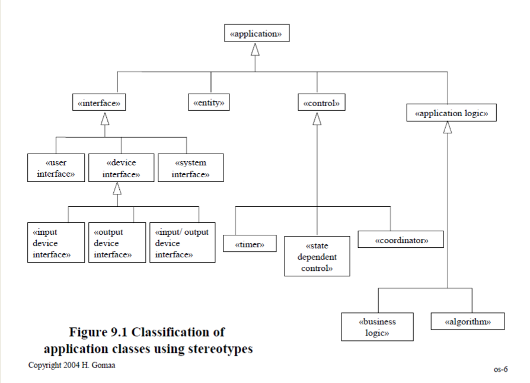
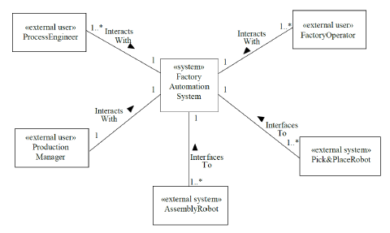
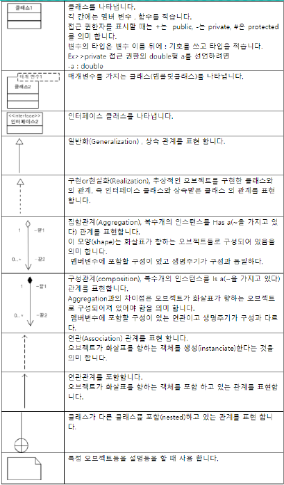

# Object Structuring Class Diagram

시스템 내의 Object들을 정의  

  

## Object Structuring Criteria
### Interface Objects  
external 환경에 대한 interface  
각 software interface object는 외부 object와 상호작용함
- `User inteface object`
- `Device interface object`
- `System interface object`  

*I/O device object
- I/O device interface object (e.g. ATM card reader interface)
- Input device interface object (e.g. Sensor interface)
- Output device interface object (e.g. Actuator interface)

### Entity Objects  
정보를 담고 있는 long lasting objects

### Control Objects  
use case의 실행을 위한 overall coordination을 제공 (간단한 use case는 필요X)  
- `Coordinator object`
	- collection of objects를 위한 전체적인 순서를 결정 (decides purely on the input given)
	- 조정하는 역할 (위치 지정)
- `State dependent control object`
	-  make decisions based on both inputs at current state
		- 이는 control object의 상태에 기초해 변화
		- 상태 변환 (ON/OFF)
- `Timer Objects`  
		- activated periodically

### Application Logic Objects  
- `Business logic object`
	- client 요청을 위한 business specific application logic(rules)를 정의
- `Algorithm Object`
	- encapsulates algorithm used in problem domain
		- encapsulte = 캡슐화 (객체의 속성과 행위를 하나로 묶고, 실제 구현 내용 일부를 내부에 감추어 은닉함)
- `Service object`
	- 다른 objects들의 서비스를 제공하는 object  

# Static Modeling

  

- class 간 구조적 관계를 정의
- class diagram으로 class와 그 관계를 묘사

## System context class diagram

- 시스템과 외부 환경 간의 경계를 정의
- `System`
	- 하나의 aggregate << system >> class
- `External environment`
	- external classes that system interfaces to
- `Categories of external classes`
	- external I/O device
	- external user
	- external system
	- external timer
- 관계 type : 일대일, 일대다, 다대다

  
