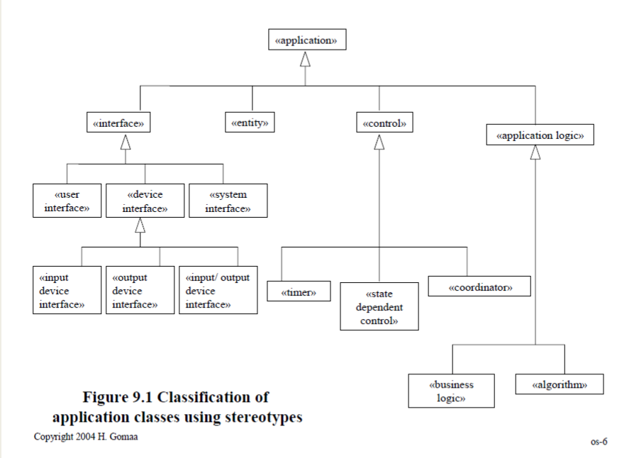

# Dynamic Modeling
Use cases refined in Dynamic Model
- show objects participating in each use case
- use `object structuring criteria` to determine objects

  

## Collaboraion Diagram  
- `use case의 object들을 graphically 묘사`
	- **objects -> boxes**
	- **their message interations -> arrows**
		- message = event + attribues
		- e.g. ATM card inserted (card id, expiration date)
	- **number sequence of messages**
- developed for each use case
	- 몇몇 object들은 하나의 collaboration diagram에서만, 혹은 여러 개에 동시에 나타날 수도 있음  

## Sequence Diagram
- `use case의 object interations의 순서 보여줌`
- object 간 전달되는 messages 강조
	- **objects -> vertical lines** (actor은 가장 좌측에)
	- **messages -> labeled horizontal arrows** (arrow의 src, dest만 유관함)
	- Time increases from top to bottom
	- 무관하면 message 사이에 spacing
	- Message sequence numbering is optional

- [(1)first optional letter sequence][(2)numeric sequence][(3)second optional letter sequence]
	- e.g. Aa1.1a
	- (1) use case id
	- (2) message sequence starting with external event (e.g. a1, a2, a3)
	- (3) Concurrent event sequences (e.g. A3, A3a)
- **Dewey Classification System** (e.g. A1, A1.1, A1.1.1, A1.2)
- **Interactive System**
	- Whole number for external event (e.g. A1)
	- Decimal number for subsequent internal events (e.g. A1.1, A1.2)

## Dynamic Analysis
- `determine how objects interact w/ each other to support use case`
	- actor로부터 external event 시작
	- usecase support를 위해 필요한 objects 결정
	- external event에 따라오는 internal events의 순서 결정
	- collaboration diagram으로 묘사
- **Non-state dependent Dynamic Analysis**
- **State dependent Dynamic Analysis**
	- controlled by statechart (= modeled using statechart)
	- control object에 의해 실행됨 (Control object activates/deactivates other objects)