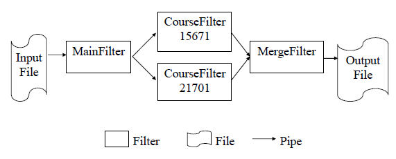
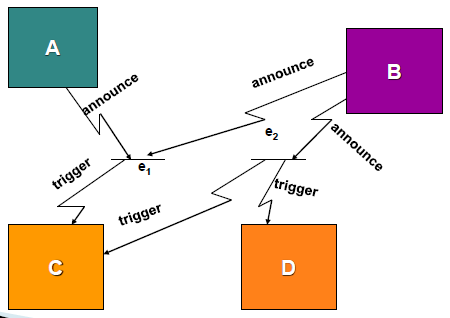
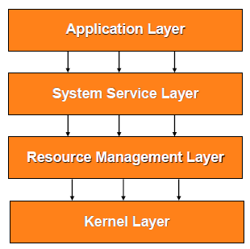
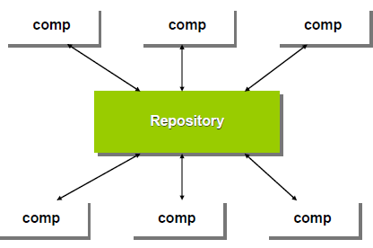
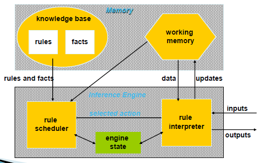
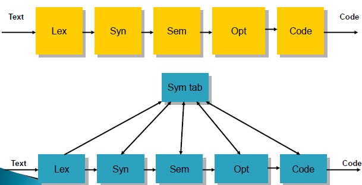

# Software Architecture

dimensions of complexity
- management complexity
- technical complexity

## Architecture란?
- 건축에서의 평면도/측면도/단면도
    - software system에 대한 상위 레벨의 구조적/행위적 모델
    - software solution 구조에 대한 커다란 그림을 보여줌
    - software의 중요한 초기 설계 결정 사항들을 표현
- `아키텍쳐는 정책이다`

|Elements of a Software System||
|:---:|:---:|
|User view of problem|Use Case Model|
|Builder's view of problem|Analysis|
|**Modules and connections**|**Architecture**|
|Methods data structures|Design|
|Algorithms & data|Code|
|Data layouts, memory maps|Executable|

## Common Architectural Styles
- Dataflow systems
    - Batch sequential
    - Pipes and filters
- Call-and-return systems
    - Main program and subroutine
    - OO systems
    - Hierarchical layers
- Independent components
    - Communicating process
    - Event systems (암시적 호출)
- Virtual machines
    - Interpreters
    - Rule-based systems
- Data-centered systems (Repositories)
    - Databases
    - Hypertext systems
    - Blackboards

### 패턴(Style)
- 정의  
 특정 설계 context에서 반복해서 발생하는 특정 문제를 기술하고 그 해결책으로 검증된 방법을 제시한다. 그 해결책은 구성 component들, 그들의 역할과 관계, 그리고 그들 간의 상호작용을 기술함으로 구성된다.
- 구성
    - 패턴 이름, 문제점, 해결책, 결과
- 종류
    - Design patterns
        - architecture, design, idiom
    - Analysis patterns
    - Organization patterns
    - Process patterns
    - Domain-specific patterns
- 표현  
    `Components + Connectors + Constraints`
    - Components : computational components
    - Connectors : components 간 interactions
    - Constraints : how they can be combined

### Pipe and Filter
- Components : Filters
- Connectors : Pipies
- Invariants
    - Filters must be independent entities (should not share state w/ other filters)
    - Filters는 그들의 upstream and downstream filters의 정체를 알지 못한다.  

  

### Event Based (Implicit invocation)
- Components
    - procedures와 events의 집합을 모두 제공하는 interfaces를 가진 modules
- Connectors
    - Event registration and procedure invocation
- Invariants
    - Announcers of events는 그 event들에 어떤 component가 영향을 받을지 알지 못한다.  

  

### Layered Systems
- Components : layers
    - 각 layer는 상위 layer에 서비스를 제공하고, 하위 layer에 client로 작용
- Connectors : protocols
- Constraints
    - topological
    - limit interation to adjacent layers
- Usage
    - Communication layer (OSI ISO model)
    - DB systems and OS
        - 몇몇 X window system protocols  

  

### Repository
- Components
    - Central data structure
        - 현재 상태를 나타냄
    - A collection of independent components
        - operate on central data store
- Traditional Database
    - The types of transactiosn in an input stream trigger selection of processes to execute
- Blackboard
    - The current state of the central data structure is the main trigger for selecting processes to execute  

  

### Rule-based Systems
- System model : 가상머신
- Components
    - 1 inference engine and 3 memories (knowledge base, working memory, and inference engine state)
- Connectors
    - Data access and production rule application
- Control
    - Usually state transition for inference engine
    - Goal-driven for selection of what to interpret

  

### Compiler Construction  
  

## Benefits
### System Integrity
- 변화를 수용하는 동안 conceptual integrity 보장
    - new requirements
    - changed requirements
    - technology churn
- system lognevity를 support

### Control of Complexity
- Divide and conquer
    - decomposition into components
    - hiding of implementation details
- Seperation of concerns
    - components (and layers) encapsulate details
    - 각기 다른 전문가들에 의해 각기 다른 component들이 구축될 수 있음

### Predictability
- Architecture iterations remove major risks
- Architecture prototypes allow for collection of metrics
    - development cost metrics
    - schedule metrics

### Testability
- Well componentized systems support better and easier diagnostics/traceability/error detection
- Testing is use-case driven

### Reuse
- Architecture -> defines rules of substitution
- Component interfaces -> define substitution boundaries
- different granularity of reuse를 가능하게 함
    - small-scale reuse at component level
    - large-scale reuse
        - subsystems, products, frameworks

### Communication
- supports communication between stakeholders
- different views address different stakeholder concerns
- architecture communicates key design decisions
- architecture design rationale communicates the tradeoffs

### Organization and Project Management
- Organizational structure aligned w/ architecture
    - development teams, subcontractors
- Components/subsystems used as units of
    - 개발, CM, testing, delivery and upgrade
- Components/subsystems developed concurrently